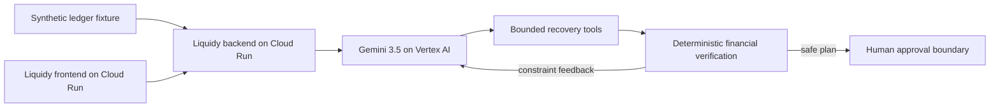

# Architecture overview

Gemini selects from typed recovery actions using read-only ledger context. The
backend validates every reference and computes the financial result without
treating model-generated amounts as authoritative. Unsafe candidates return a
structured constraint for a bounded replan. Irreversible actions remain behind
human approval.

The demo runs separate frontend and backend services on Cloud Run and calls
Gemini through Vertex AI using the Google GenAI SDK. Cloud Build and Artifact
Registry provide the deployment path; Secret Manager and Cloud Logging support
runtime configuration and evidence.

The scenario is synthetic. The demonstration does not represent a live bank
transfer, vendor certification, or a production deployment.
